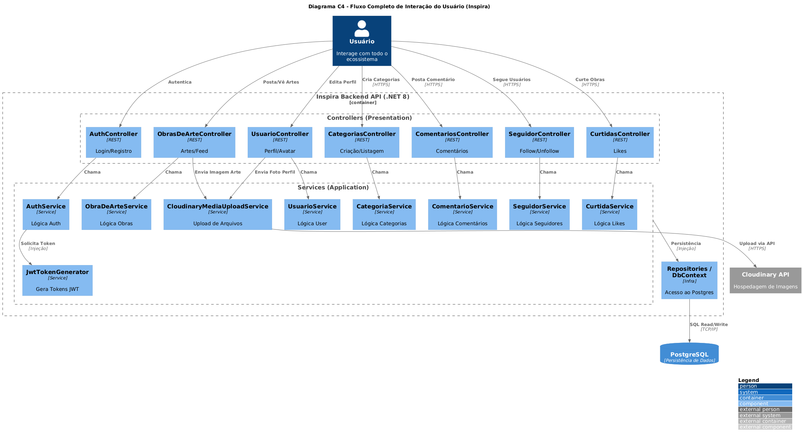

# PortifolioProjeto-2025

# Capa

- **Título do Projeto**: Inspira - Rede para Artistas Independentes.
- **Nome do Estudante**: Matheus Gabriel da Silva.
- **Curso**: Engenharia de Software.
- **Data de Entrega**: [Data].

# Resumo

Desenvolvimento de um sistema voltado para artistas independentes, permitindo a publicação de artes organizadas por tipo, facilitando a visibilidade e interação com o público. O sistema busca oferecer uma plataforma intuitiva para que artistas possam divulgar seus trabalhos e obter reconhecimento. A seguir, está detalhada a justificativa do projeto, os requisitos, a arquitetura, escolha da stack tecnológica, considerações de segurança e os próximos passos para sua implementação.

## 1. Introdução

- **Contexto**: A trajetória de um artista independente é repleta de desafios, especialmente quando se trata de conquistar visibilidade e construir uma base sólida de admiradores. Muitas plataformas disponíveis hoje, como por exemplo o Behance, o Bandcamp ou o Wattpad, oferecem espaço para portfólio ou publicação, mas não funcionam efetivamente como redes sociais voltadas à interação e ao crescimento orgânico desses criadores. Com isso, talentos promissores acabam limitados a estruturas pouco colaborativas e a redes genéricas e superlotadas, onde é difícil se destacar.
- **Justificativa**: A proposta surge da necessidade observada de um espaço digital que vá além da simples exposição de obras, oferecendo organização, acessibilidade e interação entre artistas e público. Muitas plataformas existentes não integram esses elementos de forma eficiente, o que dificulta o crescimento de criadores independentes. Além disso, o desenvolvimento deste sistema integra o portfólio de projeto do curso de Engenharia de Software da Católica SC, em Joinville, justificando sua relevância acadêmica e prática ao propor uma solução real para um problema identificado no cenário artístico atual.
- **Objetivos**:
  - Criar um sistema web que permita a publicação, categorização e gerenciamento de obras de arte por artistas independentes.
- **Objetivos Secundários**:
  - Permitir que usuários (artistas e apreciadores) interajam com as publicações por meio de curtidas, comentários e recomendações.
  - Desenvolver uma interface responsiva, intuitiva e agradável para diferentes dispositivos e perfis de usuários.
  - Implementar um sistema seguro, confiável e escalável para o armazenamento e acesso aos dados das obras e interações.

## 2. Descrição do Projeto

- **Tema do Projeto**: Um sistema que funcionará como uma vitrine digital e, ao mesmo tempo, como rede social, permitindo que o público explore as artes e interaja com os artistas por meio de curtidas, comentários e seguidores. A proposta é valorizar a arte independente e facilitar sua divulgação.
- **Problemas a Resolver**:
  - Dificuldade de artistas independentes em divulgar suas obras e obter visibilidade.
  - Baixa oferta de plataformas dedicadas à exposição de arte com boa categorização.
  - Pouca interação entre apreciadores e artistas.
- **Limitações**:
  - O sistema não realizará venda direta de artes.
  - Não haverá integração inicial com redes sociais externas.

## 3. Especificação Técnica

### 3.1. Requisitos de Software

- **Requisitos Funcionais (RF):**
  - RF001: O sistema deve permitir o cadastro de usuários como Artista ou Comum.
  - RF002: O sistema deve permitir ao Artista a publicação de artes por categoria.
  - RF003: O sistema deve permitir curtidas e comentários em artes por usuários logados.
  - RF004: O sistema deve permitir ao Artista a criação e edição de perfis personalizados.
  - RF005: O sistema deve exibir recomendações de artes baseadas nas interações do usuário.
  - RF006: O sistema deve permitir ao Administrador a moderação de conteúdo inadequado.
  - RF007: O sistema deve permitir a busca avançada por artistas (nome, estilo, categoria).
  
- **Requisitos Não Funcionais (RNF):**
  - RNF001: A interface deve ser responsiva para diferentes dispositivos.
  - RNF002: A autenticação do usuário deve ser feita via JWT (JSON Web Token).
  - RNF003: O sistema deve ter armazenamento otimizado de imagens para acesso rápido e eficiente.
  - RNF004: O sistema deve ser escalável para suportar o crescimento da base de usuários.
  - RNF005: O sistema deve ter tempo de resposta ágil para todas as requisições.

### 3.2. Considerações de Design

- Discussão sobre as escolhas de design, incluindo alternativas consideradas e justificativas para as decisões tomadas.
- **Visão Inicial da Arquitetura**: O sistema será dividido entre frontend, backend e banco de dados.
- **Padrões de Arquitetura**: Arquitetura baseada em serviços (MVC) para melhor organização do código.
- **Diagrama de Contexto**:
  

- **Diagrama de Componentes**:
  

- **Casos de Uso**:
  

  
### 3.3. Stack Tecnológica

- **Linguagens de Programação**: C# no backend e Angular no frontend.
- **Frameworks e Bibliotecas**:
  - Backend: .NET 8.
  - Frontend: Angular.
  - Autenticação: JWT com bcrypt.
  - Logging: NLog e Serilog.
- **Ferramentas de Desenvolvimento e Gestão de Projeto**:
  - Banco de Dados: PostgresSQl.
  - Versionamento: Git/GitHub.
  - Gerenciamento: Github Projects.
  - Algoritmo de IA para recomendação de posts baseado nas interações do usuário.

### 3.4. Considerações de Segurança

- Proteção contra SQL Injection e XSS.
- Hash de senhas com BCrypt.
- Uso de HTTPS.
- Controle de permissões e acessos para evitar fraudes.

## 4. Próximos Passos  

- **Documentação do Projeto**: Elaborar diagramas UML (casos de uso, modelo de dados e arquitetura) e detalhar requisitos.  
- **Definição de Layout e UX**: Criar wireframes e protótipos da interface para garantir uma experiência intuitiva.  
- **Criação do Modelo de Dados**: Estruturar o banco de dados conforme os requisitos levantados.  
- **Implementação das Funcionalidades CRUD**: Desenvolver as operações básicas para gerenciamento dos dados.  
- **Testes e Otimização**: Realizar testes unitários e ajustes para melhorar performance e segurança.

## 5. Referências

- Documentação oficial do Angular.
- Documentação do .NET 8.
- Princípios de segurança para aplicações web.

## 6. Apêndices (Opcionais)

-

## 7. Avaliações de Professores

